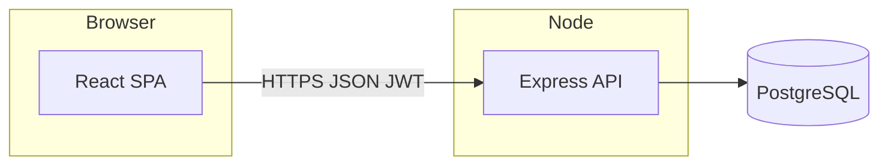

# Stray Animals Shelter Management System

## 1. Project overview

This application supports **stray animal shelter operations** in Pakistan: intake and health records, rescue reporting, adoption processing, staff management, and owner surrender workflows. It is the Advanced Database Management course project: a **PostgreSQL** database, a **Node.js / Express** REST API with JWT auth and role-based access, and a **React (Vite)** single-page frontend.

---

## 2. Tech stack

| Layer | Technology |
|--------|------------|
| Frontend | React 19, React Router 7, Vite 8, Recharts |
| Backend | Node.js, Express, `pg`, `bcrypt`, `jsonwebtoken`, `dotenv`, `cors` |
| Database | PostgreSQL 14+ |
| Auth | JWT in `Authorization: Bearer` header; passwords hashed with bcrypt |

---

## 3. System architecture

The **React** app calls the **Express** API (`/api/v1/...`). Express uses a connection pool to **PostgreSQL**. Business rules, constraints, and triggers live in the database; multi-step business flows use **explicit SQL transactions** in the controllers (e.g. adoption, surrender, rescue mission dispatch).



---

## 4. UI examples (max 3)

Place **screenshots** under `media/` and reference them here for your submission ZIP.

1. **Dashboard** — Role-aware summary cards and **polling** (25s) for live-ish counts; links into main workflows. *Why:* gives evaluators a quick health check of data and demonstrates real-time-style updates without WebSockets.
2. **Adoptions** — Form plus status actions with messages explaining **transaction success/rollback**. *Why:* demonstrates the required atomic adoption flow in the UI.
3. **Animals** — Filters, CRUD, **batch status updates**, and **CSV export**. *Why:* covers advanced search/filtering, batch operations, and spreadsheet-style reporting.

---

## 5. Setup and installation

### Prerequisites

- **Node.js** 20+ (for Vite 8 and tooling)
- **PostgreSQL** with `psql`
- `npm`

### Database

```bash
sudo -u postgres psql
CREATE DATABASE shelter_db;
CREATE USER shelter_admin WITH PASSWORD 'meow';
GRANT ALL PRIVILEGES ON DATABASE shelter_db TO shelter_admin;
\q

cd database
PGPASSWORD=meow psql -h localhost -U shelter_admin -d shelter_db -f schema.sql
PGPASSWORD=meow psql -h localhost -U shelter_admin -d shelter_db -f seed.sql
PGPASSWORD=meow psql -h localhost -U shelter_admin -d shelter_db -f performance.sql
```

### Backend

```bash
cp .env.example backend/.env
# Edit backend/.env: DB_* and JWT_SECRET

cd backend
npm install
node src/seed-passwords.js   # hashes passwords for seed employees
npm start                    # default http://localhost:3000
```

| Variable | Meaning |
|----------|---------|
| `PORT` | API port (default 3000) |
| `DB_HOST`, `DB_PORT`, `DB_NAME`, `DB_USER`, `DB_PASSWORD` | PostgreSQL connection |
| `JWT_SECRET` | Signing key for tokens (use a long random string in production) |
| `JWT_EXPIRES_IN` | e.g. `24h` |

### Frontend

```bash
cp frontend/.env.example frontend/.env
# VITE_API_URL=http://localhost:3000/api/v1

cd frontend
npm install
npm run dev                  # default http://localhost:5173
```

| Variable | Meaning |
|----------|---------|
| `VITE_API_URL` | Base URL for API (no trailing slash), must include `/api/v1` |

Production build:

```bash
cd frontend && npm run build
# Serve `frontend/dist` with any static host; ensure API URL points to your server.
```

---

## 6. User roles and test accounts

After `seed-passwords.js`, default password is **`password123`** for seeded staff (unless you change it when creating users via the API).

| Role | Capabilities (summary) | Example login (seed) |
|------|------------------------|----------------------|
| **Manager** | Employees, animals CRUD, adoptions, rescues, missions, surrender | `ali.hassan@sas.org.pk` |
| **Veterinarian** | Create/update animals, care logs (incl. edit/delete) | `sara.ahmed@sas.org.pk` |
| **Rescuer** | Reports, missions | `usman.khan@sas.org.pk` |
| **Caretaker** | View animals, add care logs | `fatima.malik@sas.org.pk` |
| **Admin** | Adoptions, reports (not rescue *missions* API), surrender | `bilal.q@sas.org.pk` |

**Self-registration** creates a **Caretaker** at the chosen branch (`POST /auth/register`).

---

## 7. Feature walkthrough

| Feature | Role | API / page |
|--------|------|------------|
| Login / register / logout | All | `/auth/login`, `/auth/register`, JWT stored in `localStorage` |
| Dashboard + polling | All | `/`, aggregates from `/animals`, `/adoptions`, `/rescues/...` |
| Animals list & detail | All (edit per RBAC) | `GET/PATCH/DELETE /animals`, `GET/PATCH .../care-logs/...` |
| Public stray report | Public | `POST /rescues/reports`, page `/report-stray` |
| Adoptions | Manager, Admin | `/adoptions` |
| Rescues | Manager, Rescuer, Admin (missions: no Admin) | `/rescues` |
| Staff CRUD (create + activate/deactivate) | Manager | `/employees` |
| Surrender intake (transaction) | Manager, Admin | `POST /animals/surrender` |
| Analytics charts | All | `/analytics` |
| CSV export | All (from animals page) | Client-side export of filtered rows |
| Toast notifications | All | Success / warning toasts on key actions |
| API health badge | Authenticated layout | Polls `/api/v1/health` every 30s |
| Debounced animal search | All | Reduces re-filter churn while typing |
| 404 page | All | Unknown routes show a help screen instead of redirecting home |
| Lookup data | Authenticated (roles per route) | `/lookup/*` |
| Public branch/city lists | None | `/public/branches`, `/public/cities` |

---

## 8. Transaction scenarios

| Flow | Trigger | Atomic operations | Rollback if | Code |
|------|---------|-------------------|-------------|------|
| **Adoption create/complete** | UI or `POST /adoptions`, `PATCH /adoptions/:id/status` | Lock/check animal, insert/update adoption, optionally set animal `Adopted` | Animal missing, not “In Shelter”, or DB error | `backend/src/controllers/adoptions.js` |
| **Owner surrender** | `POST /animals/surrender` | Insert animal, `animal_sale`, initial `animal_care_log` | Any step fails | `backend/src/controllers/surrender.js` |
| **Rescue mission create** | `POST /rescues/missions` | Optionally update report + insert mission | Invalid/inactive team, DB error | `backend/src/controllers/rescues.js` → `createMission` |

Capture **rollback evidence** (logs or screenshots) in `media/` as required by the course.

---

## 9. ACID compliance

Concrete mechanisms are documented in **`docs/ACID_Documentation.pdf`** (and `.typ` source). In short: **Atomicity** via `BEGIN`/`COMMIT`/`ROLLBACK` in controllers; **Consistency** via CHECK constraints, foreign keys, and triggers in `schema.sql`; **Isolation** from PostgreSQL’s default isolation for those transactions; **Durability** once committed to PostgreSQL.

---

## 10. Indexing and performance

Defined in **`database/performance.sql`** (with before/after `EXPLAIN ANALYZE`):

| Index | Table | Purpose |
|-------|--------|---------|
| `idx_animal_status` | `animal` | Filter by shelter status |
| `idx_animal_health` | `animal` | Filter by health |
| `idx_branch_city` | `branch` | Join/filter by city |
| `idx_shift_employee`, `idx_shift_date` | `employee_shift` | Shift aggregations |

Re-run the script’s `EXPLAIN ANALYZE` blocks on your machine for exact timings.

---

## 11. API quick reference

| Method | Route | Auth | Purpose |
|--------|-------|------|---------|
| POST | `/auth/register` | No | Register Caretaker |
| POST | `/auth/login` | No | JWT |
| GET | `/auth/me` | Yes | Current user |
| GET | `/public/cities`, `/public/branches` | No | Public forms |
| GET | `/lookup/*` | Yes (role varies) | Reference data |
| CRUD | `/animals`, `/animals/:id` | Yes | Animals |
| POST | `/animals/surrender` | Manager, Admin | Surrender transaction |
| * | `/animals/:id/care-logs` | Yes | Care logs + PATCH/DELETE log |
| * | `/adoptions` | Manager, Admin | Adoptions |
| * | `/rescues/reports` | Mixed | GET/PATCH auth; POST public |
| * | `/rescues/missions` | Manager, Rescuer | Missions |
| * | `/employees` | Manager | Staff |

Full detail: **`docs/swagger.yaml`** (also at repo root as `swagger.yaml`).

---

## 12. Known issues and limitations

- **Swagger** examples for some schemas still use older enum labels (e.g. animal status); the implementation follows **`schema.sql`** (`In Shelter`, `Adopted`, etc.).
- **Batch animal status** in the UI sends **one PATCH per animal**; it is not a single database transaction (partial success is possible and is reported in the UI).
- **Adoption / mission / surrender** error messages from the API are generic on some 500 paths; check server logs for detail.
- **Frontend chunk size** warning on `npm run build` is expected; optional code-splitting was not required for the course demo.

---

## Quick test (API)

```bash
curl -X POST http://localhost:3000/api/v1/auth/login \
  -H "Content-Type: application/json" \
  -d '{"email":"ali.hassan@sas.org.pk","password":"password123"}'

curl http://localhost:3000/api/v1/animals -H "Authorization: Bearer TOKEN"
```
