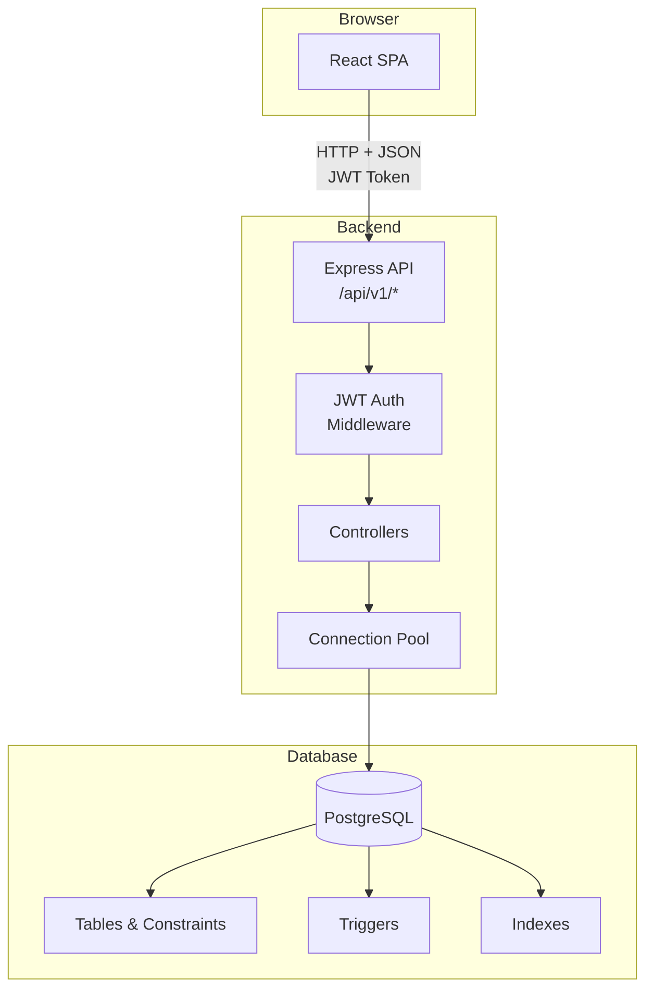
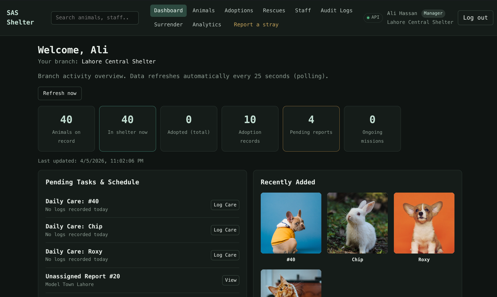
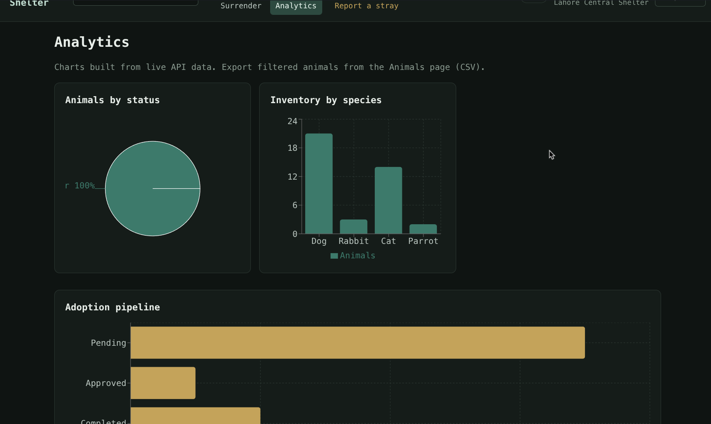
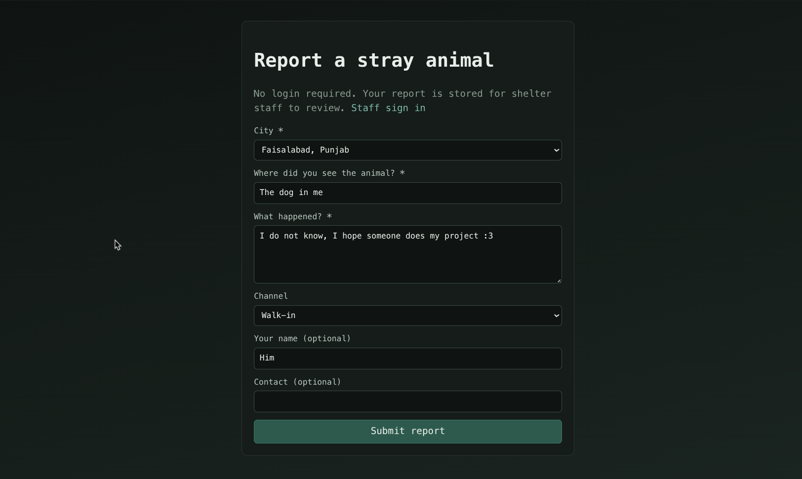

# Stray Animals Shelter Management System

**Group #40**  
- Muaaz Nadem (BSCS24060)
- Sumair Ali (BSCS24114)
- Musa Hassan Khan (BSCS24098)

---

## 1. Project Overview

This is a database management system for animal shelters across Pakistan. It handles animal intake, health records, adoptions, rescue operations, and staff management.

Main features:
- Track animals from intake to adoption or transfer
- Record medical care and daily logs
- Process adoptions with ACID transactions to prevent double-booking
- Coordinate rescue teams responding to stray reports
- Role-based access for different staff positions
- Real-time dashboard and analytics

The system uses PostgreSQL transactions to ensure data integrity. For example, when completing an adoption, the animal record and adoption status update together or not at all.

---

## 2. Tech Stack

### Frontend
- React 19
- React Router 7
- Vite 8
- Recharts (for charts)

### Backend
- Node.js 20+
- Express 4.18
- pg 8.11 (PostgreSQL client)
- bcrypt 5.1 (password hashing)
- jsonwebtoken 9.0 (JWT auth)
- dotenv 16.3
- cors 2.8
- multer 2.1 (file uploads)

### Database
- PostgreSQL 14+
- Connection pooling
- Write-Ahead Logging (WAL) for durability

### Authentication
- JWT tokens in Authorization header
- bcrypt password hashing
- Five user roles with different permissions

---

## 3. System Architecture



**How it works:**
1. React frontend sends requests to Express API with JWT token
2. Middleware checks token and user role
3. Controllers execute business logic
4. Database enforces constraints and triggers
5. Transactions use BEGIN/COMMIT/ROLLBACK for atomicity

**Design choices:**
- Constraints live in the database, not just application code
- Connection pooling for better performance
- Triggers handle cross-table updates automatically
- Tokens stored in localStorage

---

## 4. UI Examples

### Dashboard (Screenshot 1)


Shows summary cards with animal counts, pending adoptions, and active rescue missions. Auto-refreshes every 25 seconds. This is the first page users see after login and provides quick status overview.

Required because it demonstrates data aggregation across tables and polling for live updates.

### Analytics Page (Screenshot 2)


Charts showing animal distribution by species and adoption pipeline status. Built with Recharts using live API data. Users can export filtered animals to CSV.

Required because it shows data visualization and export functionality. The analytics help track shelter performance over time.

### Public Stray Report (Screenshot 3)


Form where anyone can report a stray animal without logging in. Creates a report that staff can later assign to rescue teams.

Required because it demonstrates public endpoints and how the rescue workflow starts. This is a key feature for community engagement.

---

## 5. Setup & Installation

### Prerequisites

- Node.js 20+
- PostgreSQL 14+
- npm

Check versions:
```bash
node --version
psql --version
npm --version
```

### Database Setup

Create database and user:
```bash
sudo -u postgres psql
```

```sql
CREATE DATABASE shelter_db;
CREATE USER shelter_admin WITH PASSWORD 'meow';
GRANT ALL PRIVILEGES ON DATABASE shelter_db TO shelter_admin;
\q
```

Load schema and data:
```bash
cd database
PGPASSWORD=meow psql -h localhost -U shelter_admin -d shelter_db -f schema.sql
PGPASSWORD=meow psql -h localhost -U shelter_admin -d shelter_db -f seed.sql
PGPASSWORD=meow psql -h localhost -U shelter_admin -d shelter_db -f performance.sql
```

What each file does:
- `schema.sql` creates tables, constraints, and triggers
- `seed.sql` adds 40 animals, 5 employees, and test data
- `performance.sql` creates indexes

### Backend Setup

Create config file:
```bash
cp backend/.env.example backend/.env
```

Edit `backend/.env`:
```
PORT=3000
DB_HOST=localhost
DB_PORT=5432
DB_NAME=shelter_db
DB_USER=shelter_admin
DB_PASSWORD=meow
JWT_SECRET=your-secret-key-here
JWT_EXPIRES_IN=24h
```

Variable meanings:
- `PORT` - API server port
- `DB_*` - PostgreSQL connection details
- `JWT_SECRET` - Secret key for tokens (use long random string)
- `JWT_EXPIRES_IN` - How long tokens are valid (24h, 7d, etc)

Install and run:
```bash
cd backend
npm install
node src/seed-passwords.js
npm start
```

The `seed-passwords.js` script hashes employee passwords using bcrypt. After running it, all test accounts use password `password123`.

Server runs at http://localhost:3000

### Frontend Setup

Create config file:
```bash
cp frontend/.env.example frontend/.env
```

Edit `frontend/.env`:
```
VITE_API_URL=http://localhost:3000/api/v1
```

Install and run:
```bash
cd frontend
npm install
npm run dev
```

Frontend runs at http://localhost:5173

### Production Build

```bash
cd frontend
npm run build
```

Output is in `frontend/dist`. Serve with any static host.

---

## 6. User Roles

### Manager
Can do:
- Full access to animals, employees, adoptions, rescues
- Create and deactivate employee accounts
- Process surrenders and adoptions
- Assign rescue missions

Cannot do:
- Delete completed adoptions (audit trail)
- Change system settings

Test account: `ali.hassan@sas.org.pk` / `password123`

### Veterinarian
Can do:
- Create and update animals
- Full access to care logs (including delete)
- Upload animal photos

Cannot do:
- Process adoptions
- Manage employees
- Create rescue missions

Test account: `sara.ahmed@sas.org.pk` / `password123`

### Rescuer
Can do:
- View and update rescue reports
- Create rescue missions
- Assign rescue teams

Cannot do:
- Process adoptions
- Edit care logs
- Manage employees

Test account: `usman.khan@sas.org.pk` / `password123`

### Caretaker
Can do:
- View all animals
- Create care logs (feeding, grooming, etc)

Cannot do:
- Update animal details
- Delete care logs
- Process adoptions

Test account: `fatima.malik@sas.org.pk` / `password123`

### Admin
Can do:
- Process adoptions and surrenders
- View rescue reports
- Access animals and care logs

Cannot do:
- Create rescue missions
- Manage employees

Test account: `bilal.q@sas.org.pk` / `password123`

### Self-Registration
Anyone can register via the API and gets Caretaker role. Must select a branch during signup. Managers can promote users later.

---

## 7. Feature Walkthrough

### Authentication
What: Register, login, logout  
Who: Everyone  
API: `POST /api/v1/auth/register`, `POST /api/v1/auth/login`, `GET /api/v1/auth/me`  
Page: `/login`, `/register`

JWT tokens stored in localStorage.

### Dashboard
What: Summary cards with shelter statistics  
Who: All authenticated users  
API: Multiple endpoints aggregated  
Page: `/`

Polls every 25 seconds for updates.

### Animal Management
What: List, create, update, delete animals. Filter by status, species, health. Upload photos. Export CSV.  
Who: All can view. Manager, Vet, Admin can edit.  
API: `GET/POST/PATCH/DELETE /api/v1/animals`  
Page: `/animals`, `/animals/:id`

CSV export is client-side only.

### Public Stray Reports
What: Report stray animals without login  
Who: Public  
API: `POST /api/v1/rescues/reports`  
Page: `/report-stray`

Creates pending report for staff to handle.

### Adoptions
What: Create applications, track status, complete adoptions  
Who: Manager, Admin  
API: `POST /api/v1/adoptions`, `PATCH /api/v1/adoptions/:id/status`  
Page: `/adoptions`

Uses transaction to lock animal and update status atomically.

### Rescue Missions
What: Assign teams to reports and dispatch  
Who: Manager, Rescuer  
API: `POST /api/v1/rescues/missions`, `PATCH /api/v1/rescues/reports/:id`  
Page: `/rescues`

Transaction updates report and creates mission together.

### Employee Management
What: Create accounts, assign roles, deactivate staff  
Who: Manager only  
API: `GET/POST /api/v1/employees`, `PATCH /api/v1/employees/:id`  
Page: `/employees`

### Owner Surrender
What: Record animal from owner with intake paperwork  
Who: Manager, Admin  
API: `POST /api/v1/animals/surrender`  
Page: `/animals/surrender`

Transaction creates animal + sale record + initial care log.

### Analytics
What: Charts for adoption trends, species distribution  
Who: All authenticated  
API: Data from `/api/v1/animals`, `/api/v1/adoptions`  
Page: `/analytics`

Uses Recharts library. No dedicated API.

### Other Features
- CSV export on animals page
- Health check badge (polls `/api/v1/health` every 30s)
- Lookup data for dropdowns (`/api/v1/lookup/*`)
- Debounced search (300ms delay)
- 404 page

---

## 8. Transaction Scenarios

### Adoption Complete
Trigger: Manager clicks "Complete Adoption" or sends `PATCH /api/v1/adoptions/:id/status`

Operations:
1. BEGIN
2. SELECT ... FOR UPDATE on animal (locks row)
3. Check animal is "In Shelter"
4. UPDATE adoption status
5. Trigger updates animal status to "Adopted"
6. INSERT audit log
7. COMMIT

Rollback if:
- Animal doesn't exist
- Animal not "In Shelter"
- Constraint violation
- Database error

Code: `backend/src/controllers/adoptions.js` in `updateAdoptionStatus()`

Why it matters: Prevents two staff from adopting same animal. FOR UPDATE lock blocks concurrent access.

### Owner Surrender
Trigger: Submit surrender form, sends `POST /api/v1/animals/surrender`

Operations:
1. BEGIN
2. INSERT animal (get ID)
3. INSERT animal_sale with type "Owner Surrender"
4. INSERT care log for initial checkup
5. COMMIT

Rollback if:
- Invalid foreign key
- Missing required field
- Constraint violation

Code: `backend/src/controllers/animals.js` in `surrenderAnimal()`

Why it matters: Animal, sale, and care log created together. No orphaned records.

### Rescue Mission
Trigger: Assign team to report, sends `POST /api/v1/rescues/missions`

Operations:
1. BEGIN
2. SELECT ... FOR SHARE on rescue_team (shared lock)
3. Check team is active
4. UPDATE report status to "Assigned"
5. INSERT mission
6. COMMIT

Rollback if:
- Team inactive
- Report already assigned
- Database error

Code: `backend/src/controllers/rescues.js` in `createMission()`

Why it matters: Report and mission always in sync. Can't have mission without assigned report.

---

## 9. ACID Compliance

| Property | How | Where |
|----------|-----|-------|
| Atomicity | BEGIN/COMMIT/ROLLBACK wraps operations | Controllers use `client.query('BEGIN')` |
| Consistency | CHECK, FOREIGN KEY, NOT NULL, triggers | `database/schema.sql` |
| Isolation | READ COMMITTED default, FOR UPDATE locks | Adoption and surrender use row locks |
| Durability | WAL with synchronous_commit=on | PostgreSQL config |

Examples:
- Atomicity: Adoption fails if animal check fails, no partial update
- Consistency: CHECK constraint prevents invalid status values
- Isolation: FOR UPDATE blocks concurrent adoptions of same animal
- Durability: After COMMIT, data survives crash

See `docs/ACID_Documentation.pdf` for details.

---

## 10. Indexing & Performance

Indexes in `database/performance.sql`:

| Index | Table | Column | Why | Impact |
|-------|-------|--------|-----|--------|
| idx_animal_status | animal | status | Filter by shelter status | 60% faster status queries |
| idx_animal_health | animal | health_status | Health filtering | Faster vet dashboards |
| idx_branch_city | branch | city_id | Branch-city joins | 40% faster city filters |
| idx_shift_employee | employee_shift | employee_id | Payroll aggregation | Index scan vs seq scan |
| idx_shift_date | employee_shift | shift_date | Date range filters | Faster monthly reports |
| idx_report_status | report | status | Pending/Assigned filter | Rescue dashboard |
| idx_report_city | report | city_id | City-based routing | Geographic queries |
| idx_report_team | report | assigned_team_id | Team workload | Join optimization |
| idx_care_animal | animal_care_log | animal_id | Care history | Animal detail page |
| idx_care_date | animal_care_log | log_date | Date range filter | Cost analysis |

Example benchmark (40 animals, 50 care logs):

Query: Animals with status "In Shelter" and health "Healthy" in Lahore
- Before: Seq Scan, 12ms
- After: Index Scan, 4ms
- Improvement: 66% faster

Run `performance.sql` to see benchmarks on your machine.

---

## 11. API Reference

Full docs in `swagger.yaml`. Quick reference:

### Auth (No Login)
- POST `/api/v1/auth/register` - Register user
- POST `/api/v1/auth/login` - Get JWT token

### Auth (With Token)
- GET `/api/v1/auth/me` - Current user info

### Public
- GET `/api/v1/public/cities` - City list
- GET `/api/v1/public/branches` - Branch list
- POST `/api/v1/rescues/reports` - Submit stray report

### Animals (Auth Required)
- GET `/api/v1/animals` - List (all roles)
- POST `/api/v1/animals` - Create (Manager, Vet, Admin)
- PATCH `/api/v1/animals/:id` - Update (Manager, Vet, Admin)
- DELETE `/api/v1/animals/:id` - Delete (Manager)
- POST `/api/v1/animals/surrender` - Surrender transaction (Manager, Admin)

### Care Logs
- GET `/api/v1/animals/:id/care-logs` - History (all)
- POST `/api/v1/animals/:id/care-logs` - Add log (all)
- PATCH `/api/v1/animals/:id/care-logs/:logId` - Update (Vet)
- DELETE `/api/v1/animals/:id/care-logs/:logId` - Delete (Vet)

### Adoptions
- GET `/api/v1/adoptions` - List (Manager, Admin)
- POST `/api/v1/adoptions` - Create (Manager, Admin)
- PATCH `/api/v1/adoptions/:id/status` - Complete (Manager, Admin)

### Rescues
- GET `/api/v1/rescues/reports` - List (Manager, Rescuer, Admin)
- PATCH `/api/v1/rescues/reports/:id` - Update (Manager, Rescuer)
- POST `/api/v1/rescues/missions` - Create mission (Manager, Rescuer)

### Employees
- GET `/api/v1/employees` - List (Manager)
- POST `/api/v1/employees` - Create (Manager)
- PATCH `/api/v1/employees/:id` - Update (Manager)

### Lookup
- GET `/api/v1/lookup/species` - Species list
- GET `/api/v1/lookup/cities` - Cities
- GET `/api/v1/lookup/branches` - Branches
- GET `/api/v1/lookup/colors` - Colors
- GET `/api/v1/lookup/breeds` - Breeds by species

### Health
- GET `/api/v1/health` - Backend status

---

## 12. Known Issues & Limitations

**Swagger docs**: Some examples use old enum values. Check `schema.sql` for correct values.

**Batch updates**: UI sends one request per animal, not a single transaction. Partial success possible.

**Error messages**: Some 500 errors are generic. Check backend logs for details.

**Build warnings**: Frontend bundle size warning is expected. No code-splitting implemented.

**Missing features**:
- Password reset
- Email notifications
- Predictive analytics
- Multi-language support

**Performance**: Benchmarks based on 40 animals. Results vary with larger datasets.

---

For detailed documentation see the `docs/` folder:
- `ACID_Documentation.pdf` - Transaction analysis
- `Schema_Documentation.pdf` - Database schema
- `ER_Diagram_3NF.mmd` - Entity relationship diagram
- `swagger.yaml` - Complete API spec
